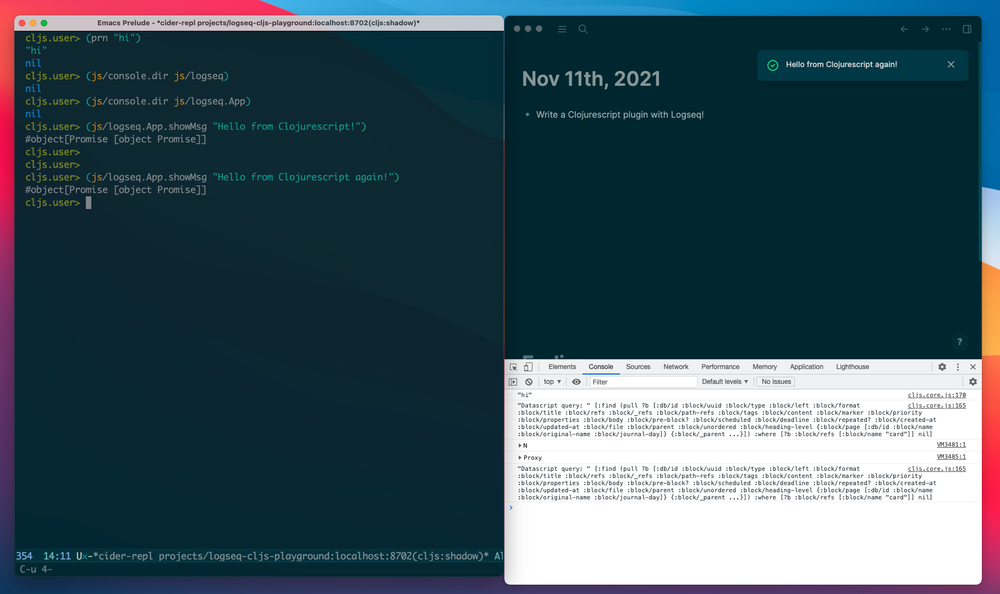
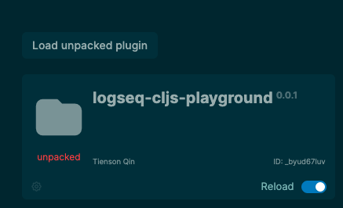

## logseq-cljs-playground
A silly project to show how to use Clojurescript to write a simple plugin for Logseq.



## Develop

``` shell
yarn
yarn watch
# Enable developer mode in Logseq
# Click "Load unpacked plugin" to open this folder
# Click the "Reload" button to refresh latest changes
```



### Connect to the repl

## Release

``` shell
yarn release
```
